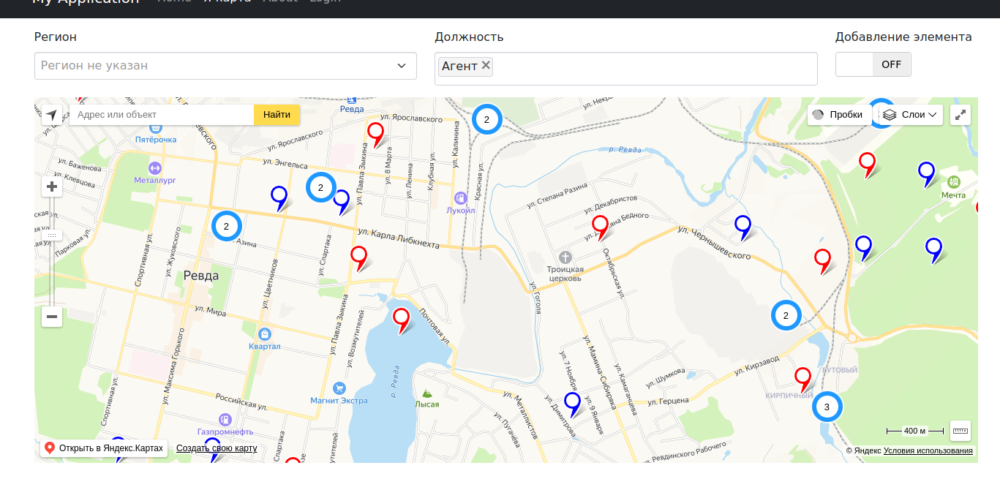

# Проект «Север против Юга»

1. Создать страницу посредством фреймворка yii2
2. На странице отобразить карту сервиса Яндекс
3. На карте в пределах 1 или нескольких населенных пунктов отобразить 100 000
меток (объектов)
4. Каждая метка должна иметь 2 сущности:
◦ Регион объекта — имеет 2 значения: Север, Юг
◦ Должность объекта — имеет 3 значения: монтажник, агент, выездной
инженер
5. При клике мышкой на метке во всплывающей подсказке должны
отображаться регион и должность
6. На карте добавить 2 фильтра с сущностями п.2 с множественным выбором на
каждом фильтре.
7. Данные фильтры пересекаются по принципу AND — т.е. можно выбрать
фильтре региона: «Север», в фильтре должности: «выездной инженер» и
«монтажник», и на карте отобразятся только монтажники и выездные
инженеры северного региона.
8. На страницу добавить форму добавления нового объекта с выбором региона,
должности, координат нахождения.
9. При добавлении объекта отображать его на карте по аналогии с остальными

## Инструкция запуска

Для запуска проекта необходимо:
* скачать репозиторий и перейти в его коневой каталог.
* при помощи команды ``` docker compose up  ``` запустить контейнеры
* перейти в контейнер php и выаолнить установку пакетов php используя команду ``` composer i ```
* Используя консольную команду ``` ./yii migrate ``` применить миграции
* Далее при помощи команды ``` ./yii employee/generate [N] ``` Сгенерировать N записей в таюлице сотрудников. N  можно опускать, тогда записей будет 10
* В браузере открыть [url](http://127.0.0.1:8081/ya-map/index) и потыкать функционал

## Вешний вид

Внешний вид приложения представлен на рисунке:

Вверхней части фстраницы расположена форма-фильтр. Она предназначена для фильтрации объектов на карте в зависимости от их свойств. Переключатель "Добавить элемент", нужен для переключения режимов формы: фильтр/добавление записей. Фитипация элементов происходит сразу после изменения значений в полях формы. Добавление эоемента происхолит по клику ЛКМ (тевая кнопка мыши) по карте, при этом должны быть корректно заполнены поля Регион и Должность, а так же переключатель должен находиться в позиции "ON". После клика (ЛКМ) по маркеру появляется всплывающее сообщение с данными о сотруднике (район и должность). Также для более точного разделения маркетов Севера и Юга .. маркеты были окрашены в цвета красный - для Юга и синий - для Севера.